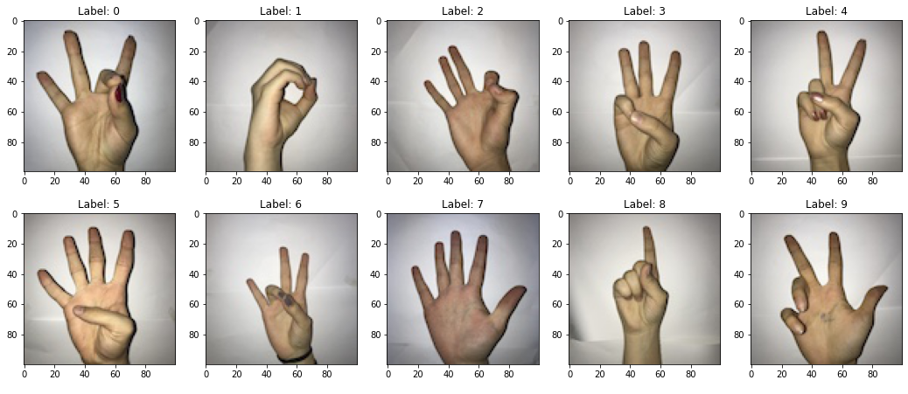
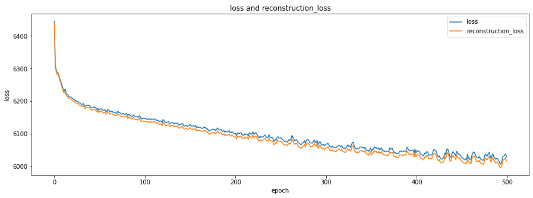
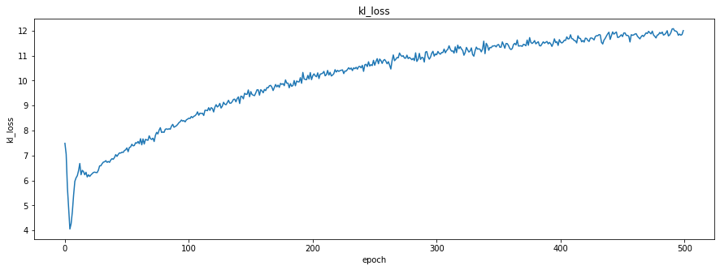
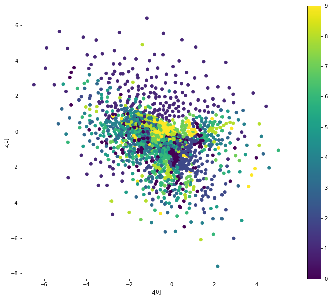
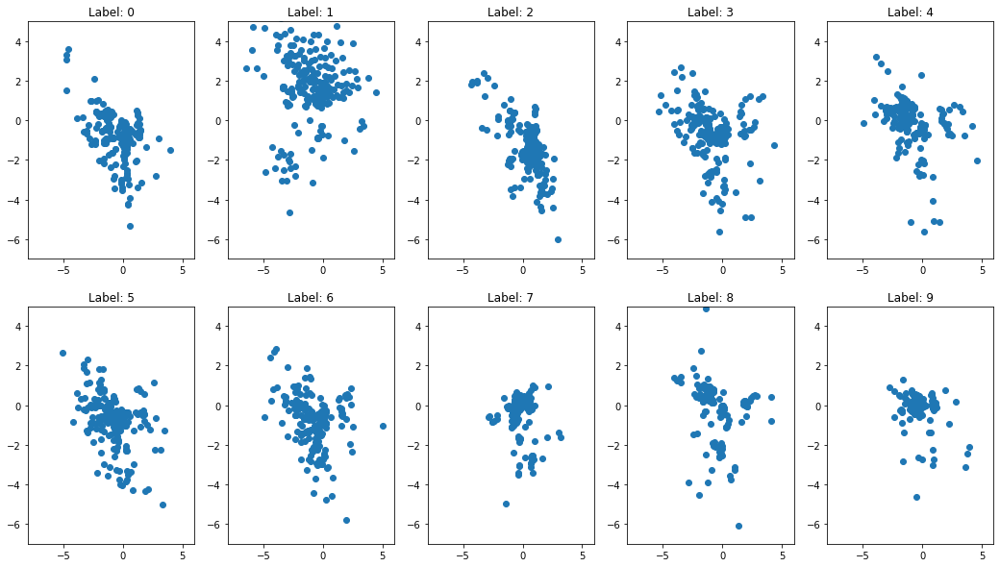
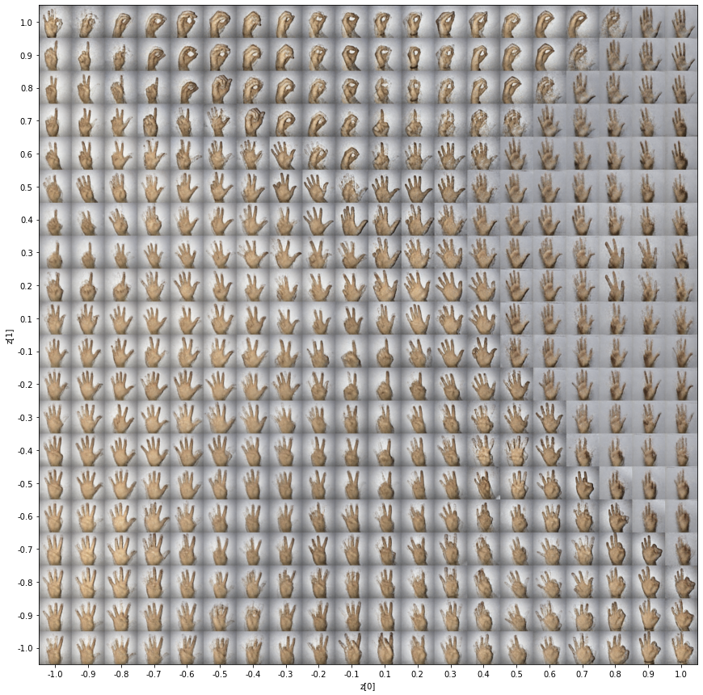

# VAE

### Project
The goal of this project was to implement Variational Autoencoder (VAE) to build generative model and, by the way, illustrates the potential of the autoencoders as a dimension reduction tool. The inspiration for this exercise was the article [Variational Autoencoder (VAE)](https://lilianweng.github.io/posts/2018-08-12-vae/). 
Illustration of variational autoencoder model with the multivariate Gaussian assumption. 
 

### Dataset
[Sign-Language-Digits-Dataset](https://github.com/ardamavi/Sign-Language-Digits-Dataset) by Turkey Ankara Ayrancı Anadolu High School Students. 
Dataset contains images of sign language representation of numbers from 0 to 9 (10 classes). 
 
- Image size: 100 x 100 pixels
- Color space: RGB
- Number of classes: 10 (Digits: 0-9)
- Number of participant students: 218
- Number of samples per student: 10

### Results
The learning process (500 epochs) is presented in the graphs below. 
  
 

**VAE architecture allows to reduce dimensions from 10000 (100 x 100 pixels) to 2 features!** 
Below is the plot in the latent space. Plot shows how the latent space clusters different digit in sign language. 
Unfortunately, the results are not satisfactory enough. I would expect the points to cluster in clear clusters with high quality data.. 
 

We can show it in separate plots. 
 
 

Because the model has learned (could be better but...) how to encode different images with only two features, we can easily generate images from the appropriate class. We can create a grid of sampled sign language digits. 
 
